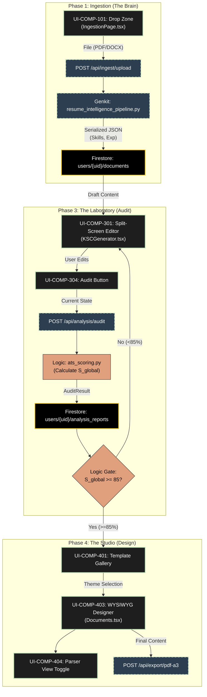

# DOC-011: Electric Alchemist Data Lifecycle & Technical Map

**Document ID:** DOC-011-DATA-MAP  
**Version:** 1.0  
**Status:** Unified Technical Specification  
**Context:** Defines the data flow, component mappings, and visual regression anchors for the "Electric Alchemist" system.

---

## 1. Technical Process Map (Mermaid.js)

This diagram traces the lifecycle of a career document from raw chaotic input to a polished "Golden Record" export.

---

## 2. Storybook Args Table (Genkit → React)

This table maps the backend JSON schema (from Genkit/Pydantic) to the frontend React Component Props used in Storybook.

### A. Score Gauge (AuditDial)
**Component:** `src/features/analysis/components/AuditDial.tsx`
**Genkit Source:** `analysis_report.json`

| Genkit Key | Type (Backend) | React Prop (Arg) | Type (Frontend) | Description |
|:---|:---|:---|:---|:---|
| `global_score` | `float` (0-100) | `score` | `number` | The primary S-Global value displayed in the center. |
| `metrics.star_density` | `float` | `starDensity` | `number` | Used to calculate the secondary ring or bar chart. |
| `validation.threshold_met` | `boolean` | `isGateOpen` | `boolean` | Triggers the "Sage Glow" vs "Terracotta" state. |
| `status` | `string` | `isLoading` | `boolean` | If status is 'calculating', show Plasma Pulse animation. |

### B. Missing Skills (ImprovementHints)
**Component:** `src/features/analysis/components/ImprovementHints.tsx`
**Genkit Source:** `analysis_report.gaps`

| Genkit Key | Type (Backend) | React Prop (Arg) | Type (Frontend) | Description |
|:---|:---|:---|:---|:---|
| `gaps.missing_keywords` | `List[str]` | `missingKeywords` | `string[]` | Array of strings to render as "Terracotta" pills. |
| `gaps.severity` | `enum` | `variant` | `'critical' \| 'warning'` | Determines the badge color intensity. |
| `auto_fix_available` | `boolean` | `canAutoFix` | `boolean` | Enables the "Magic Wand" action button. |

### C. Evidence Card (EvidenceCard)
**Component:** `src/features/editor/components/EvidenceCard.tsx`
**Genkit Source:** `user_history.experiences`

| Genkit Key | Type (Backend) | React Prop (Arg) | Type (Frontend) | Description |
|:---|:---|:---|:---|:---|
| `star_story` | `string` | `content` | `string` | The STAR-formatted text snippet. |
| `competency_tags` | `List[str]` | `tags` | `string[]` | skills matched (e.g. "Leadership") rendered as badges. |
| `confidence_score` | `float` | `matchScore` | `number` | % relevance to current question (used for sorting). |

---

## 3. High-Fidelity Visual Anchors (Regression Testing)

These are the "CSS-Critical" components that must rigorously match `DOC-009` specs. Using Playwright Visual Regression, we will assert pixel-perfect implementation.

### ⚓ Anchor 1: The Banksia Composition
**Target:** `HeroHeader`, `SplitHeader`
**Figma Spec:** DOC-009 (Section: "Typography Physics")
**Regression Criteria:**
1.  **Layering:** `Recursive` (Vine) element MUST strictly overlap `Amstelvar` (Trunk) element.
2.  **Rotation:** The Vine element should have a rotation between `2deg` and `5deg`.
3.  **Z-Index:** The Vine element must be physically on top (`z-index: 10`) of the Trunk.
4.  **Reactive Width:** At viewport `1440px`, Amstelvar `wdth` axis must be `125`.

### ⚓ Anchor 2: The Score Gauge (Plasma State)
**Target:** `AuditDial`
**Figma Spec:** DOC-009 (Section: "Prompt 03")
**Regression Criteria:**
1.  **Gradient Arc:** Must render the defined gradient (Terracotta -> Wattle -> Sage).
2.  **Typography:** The central number must be `Plus Jakarta Sans` weight `200` (Thin), NOT `900`.
3.  **Glow:** There must be a `drop-shadow` or `box-shadow` matching the current state color (Sage if >85).

### ⚓ Anchor 3: The Drop Zone (Breathing)
**Target:** `DropZone`
**Figma Spec:** DOC-009 (Section: "Prompt 02")
**Regression Criteria:**
1.  **Border:** Must be `dashed` `Sage` (`#B4D8AE`).
2.  **Background Texture:** Must show the `dot-grid` texture at ~5-8% opacity.
3.  **Dimensions:** Aspect ratio must remain consistent; "Chaos" script text must be rotated.

### ⚓ Anchor 4: Native Flora Parsing
**Target:** `NativeAnchor` (e.g., `native-waratah-hanging.png`)
**Figma Spec:** DOC-009 (Section: "Flora Asset Library")
**Regression Criteria:**
1.  **Positioning:** Must be anchored to the top-right (or specified corner).
2.  **Opacity:** Must be between `0.25` and `0.40`. NEVER `1.0`.
3.  **Interaction:** Must NOT block clicks on underlying buttons (`pointer-events: none`).
